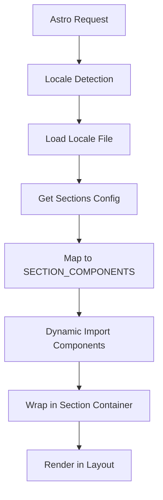

## Component-Based Architecture

The portfolio is built using Astro's component-based architecture, which enables efficient static site generation with optional client-side interactivity through React islands.

### Core Structure

The application follows a clean separation of concerns:

- **Pages**: Entry points that orchestrate sections
- **Layouts**: Reusable page templates
- **Sections**: Major content blocks (About, Skills, Experience, etc.)
- **Components**: Reusable UI elements
- **Config**: Centralized configuration management

## Dynamic Section Loading

One of the key architectural patterns is the dynamic section loading system, which uses the `SECTION_COMPONENTS` registry to map section URLs to their component implementations.

### Section Components Registry

The registry is defined in `src/config/index.ts`:

```typescript src/config/index.ts
import type { AstroComponent } from "@/types";

export const SECTION_COMPONENTS: Record<
  string,
  () => Promise<{ default: AstroComponent }>
> = {
  skills: () => import("@/sections/Skills.astro"),
  about: () => import("@/sections/About.astro"),
  experience: () => import("@/sections/Experiences.astro"),
  projects: () => import("@/sections/Projects.astro"),
  education: () => import("@/sections/Schools.astro"),
};
```

<Note>
  The registry uses dynamic imports, which enables code splitting and lazy loading of section components. Each section is only loaded when needed.
</Note>

### Section Loading in Action

The main page (`src/pages/index.astro`) demonstrates how sections are dynamically loaded and rendered:

```astro src/pages/index.astro
---
import Section from "@/components/Section.astro";
import { SECTION_COMPONENTS } from "@/config";
import { getTranslation } from "@/i18n";
import Layout from "@/layouts/Layout.astro";
import type { Locale } from "@/types";

const { currentLocale } = Astro;

if (!currentLocale)
  throw new Error("Locale not provided or default didn't load propperly");

const { t } = getTranslation(currentLocale as Locale);

const sections = t("sections");
---

<Layout>
  <main class="">
    {
      sections.map(async ({ label, url }) => {
        const loader = SECTION_COMPONENTS[url];

        if (!loader) return null;

        const Component = (await loader()).default;

        const isOptionalTitlePresent = url !== "about";

        return (
          <Section
            id={url}
            title={label}
            variant="normal"
            optionalTitle={isOptionalTitlePresent}
          >
            <Component />
          </Section>
        );
      })
    }
  </main>
</Layout>
```

## Layout Structure

The portfolio uses a single main Layout component that wraps all pages:

```
┌─────────────────────────────────────┐
│           Layout.astro              │
│  ┌───────────────────────────────┐  │
│  │         Header                │  │
│  └───────────────────────────────┘  │
│  ┌───────────────────────────────┐  │
│  │         <slot />              │  │
│  │  (Page content goes here)     │  │
│  └───────────────────────────────┘  │
│  ┌───────────────────────────────┐  │
│  │         Footer                │  │
│  └───────────────────────────────┘  │
└─────────────────────────────────────┘
```

## Data Flow

The application follows a unidirectional data flow pattern:

<Steps>
  <Step title="Locale Detection">
    Astro detects the current locale from the URL path or falls back to the default locale (Spanish).
  </Step>
  
  <Step title="Translation Loading">
    The `getTranslation()` helper loads the appropriate locale file (`en.json` or `es.json`).
  </Step>
  
  <Step title="Section Data Retrieval">
    Sections configuration is retrieved from the locale file using the translation helper:
    ```typescript
    const sections = t("sections");
    ```
  </Step>
  
  <Step title="Dynamic Component Loading">
    Each section URL is mapped to its component through `SECTION_COMPONENTS`, and the component is dynamically imported.
  </Step>
  
  <Step title="Rendering">
    Components are wrapped in the `Section` container and rendered within the `Layout`.
  </Step>
</Steps>

### Data Flow Diagram



## Configuration Management

Configuration is centralized in `src/config/index.ts`, which exports:

- `ICON_SIZE_IN_PX`: Standard icon size constant (20px)
- `SECTION_COMPONENTS`: Section component registry

<Tip>
  To add a new section:
  1. Create the section component in `src/sections/`
  2. Add an entry to `SECTION_COMPONENTS` in `src/config/index.ts`
  3. Add the section data to both locale files (`en.json` and `es.json`)
  4. The section will automatically appear on the page
</Tip>

## Benefits of This Architecture

<CardGroup cols={2}>
  <Card title="Code Splitting" icon="scissors">
    Each section is loaded only when needed, reducing initial bundle size.
  </Card>
  
  <Card title="Type Safety" icon="shield">
    TypeScript ensures compile-time type checking for all components and data.
  </Card>
  
  <Card title="Maintainability" icon="wrench">
    Centralized configuration makes it easy to add, remove, or reorder sections.
  </Card>
  
  <Card title="Internationalization" icon="globe">
    Sections automatically adapt to the current locale without code changes.
  </Card>
</CardGroup>

## File Organization

```
src/
├── pages/
│   └── index.astro          # Main entry point
├── layouts/
│   └── Layout.astro         # Page layout wrapper
├── sections/
│   ├── About.astro
│   ├── Skills.astro
│   ├── Experiences.astro
│   ├── Projects.astro
│   └── Schools.astro
├── components/
│   ├── Section.astro        # Section wrapper
│   ├── ThemeToggler.tsx     # React component
│   └── ...
├── config/
│   └── index.ts            # Configuration & constants
├── i18n/
│   └── index.ts            # Translation system
├── locales/
│   ├── en.json             # English translations
│   └── es.json             # Spanish translations
└── types/
    └── index.ts            # TypeScript types
```

<Warning>
  When adding new sections, ensure the URL key in `SECTION_COMPONENTS` matches the `url` field in your locale files' `sections` array.
</Warning>

## Utilities and Constants

### Utilities (`src/utils/index.ts`)

The project includes utility functions for common operations:

```typescript src/utils/index.ts
export const appendBaseUrl = (url: string) => {
  const baseUrl = import.meta.env.PUBLIC_BASE_URL || "";
  return `${baseUrl}${url}`;
};
```

**Usage**: Prepends the base URL from environment variables to relative paths, useful for deployed sites with custom base paths.

### Constants (`src/constants/index.ts`)

Shared constants and configuration used throughout the application:

```typescript src/constants/index.ts
import type { ProjectStatus, SocialNetwork } from "@/types";

// Project status badge styling maps
export const projectStatusLabelKeys: Record<ProjectStatus, TranslationKey>;
export const projectStatusTooltipKeys: Record<ProjectStatus, TranslationKey>;
export const baseBadgeClasses: string;
export const projectStatusBadgeClasses: Record<ProjectStatus, string>;

// Social networks configuration
export const socialNetworks: SocialNetwork[] = [
  {
    label: "GitHub",
    icon: { name: "github", isLucideIcon: false, size: 32 },
    url: "https://github.com/Jorgemacias-12",
  },
  {
    label: "LinkedIn",
    icon: { name: "linkedin", isLucideIcon: false, size: 32 },
    url: "https://www.linkedin.com/in/jamz3/",
  },
];
```

These constants centralize styling rules and configuration that need to be consistent across components.

### Type Definitions (`src/types/index.ts`)

All TypeScript interfaces and types are centralized in the types file:

```typescript src/types/index.ts
export type Locale = "en" | "es";
export type Theme = "light" | "dark";
export type SectionVariant = "hero" | "normal";
export type SkillVariant = "card" | "pill";
export type ProjectStatus =
  | "active"
  | "maintenance"
  | "completed"
  | "paused"
  | "planned"
  | "in_evaluation";

export interface Project {
  name: string;
  description: string;
  status: ProjectStatus;
  context: ProjectContext;
  tags: Skill[];
  images: Image[];
  demo_link?: LinkItem;
  repo_link: LinkItem;
}

// ... more types
```

This provides type safety throughout the application and makes it easy to maintain consistent data structures.